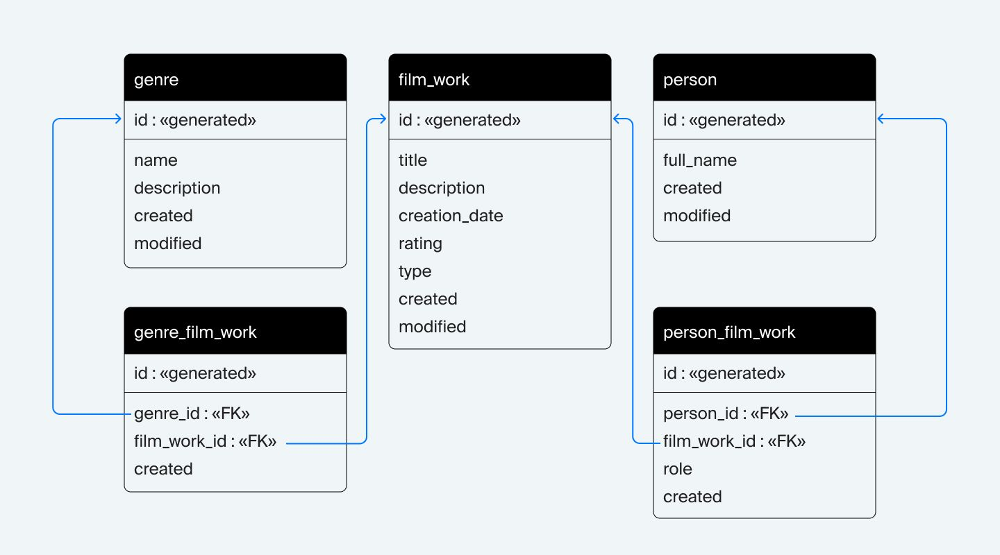

# Schema Design
### Схема базы данных


#### В данной директории хранится DDL-файл с перечнем SQL-запросов, необходимых для создания базы с нуля.

#### Для этого необходимо:

1. Запустить контейнер на основе Postgres
```commandline
docker-compose up -d --build
```

2. Выполнить команду
```commandline
psql -h 127.0.0.1 -U app -d movies_database -f movies_db.ddl
```
